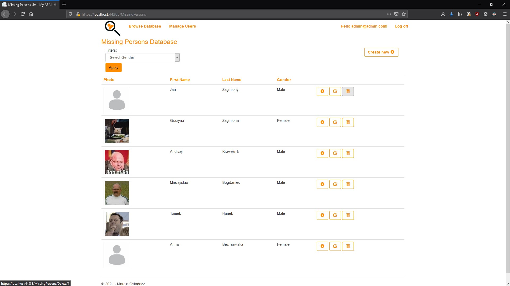

# Laboratorium 1 - ASP.NET MVC

## Zadanie

> Zrealizuj projekt informatyczny "Rejestr osób zaginionych" pozwalaj¹cy realizowaæ zadania w zale¿noœci od typu u¿ytkownika systemu. System ten bêdzie obs³ugiwany przez:
> - u¿ytkownik nieuwierzytelniony - u¿ytkownik posiadaj¹cy prawo do przegl¹dania informacji zawartych w bazie osób zaginionych oraz filtrowania informacji wed³ug kryterium p³ci
> - u¿ytkownik uwierzytelniony - u¿ytkownik zalogowany do systemu, posiadaj¹cy te same prawa co u¿ytkownika niezalogowany oraz  uprawnienia do dodawania nowych wpisów dotycz¹cych osób zaginionych
> - administrator - u¿ytkownik uwierzytelniony w systemie, posiadaj¹cy te same prawa co u¿ytkownik uwierzytelniony oraz prawa do zarz¹dzania wpisami a tak¿e innymi u¿ytkownikami systemu
> 
> W ramach realizacji zadania wykonaj:
> - Ÿród³o danych/modele, które wykorzystywane bêdzie przez budowany system informatyczny (dowolnego typu podejœcie)
> - pliki logiki
> - potrzebne szablony widoków

## Informacje ogólne

### Strona G³ówna

### Przegl¹danie informacji w bazie i filtrowanie dostêpne z poziomu u¿ytkownika nieuwierzytelnionego

### Mo¿liwoœæ dodawania nowych wpisów do bazy jako u¿ytkownik uwierzytelniony

### Mo¿liwoœæ edytowania oraz usuwania wpisów jako administrator

### Mo¿liwoœæ zarz¹dzania u¿ytkownikami jako administrator

